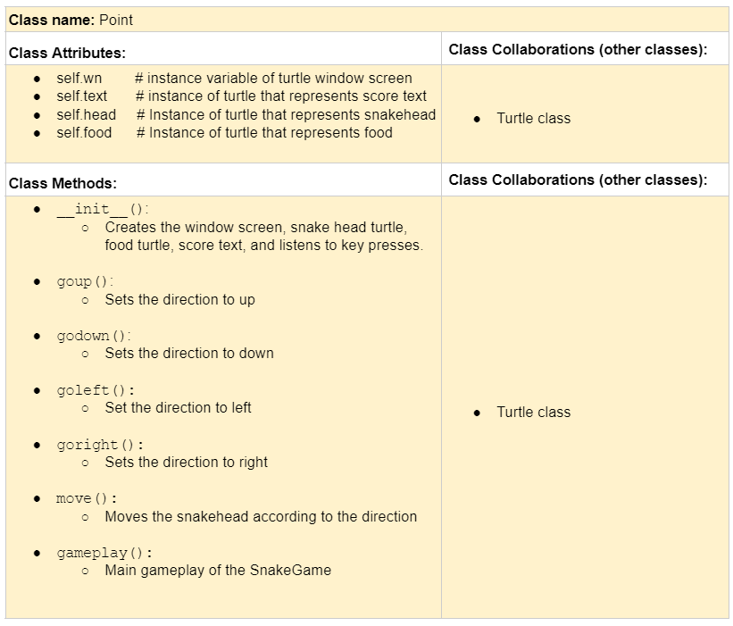

# CSC226 Project

**Term**: Spring 2022

**Author(s)**: Sam Villahermosa

---

**References**: 
Throughout this project, you have likely used outside resources. Reference all ideas which are not your own, and describe how you integrated the ideas or code into your program. This includes online sources, people who have helped you, and any other resources that are not solely your own contribution. Update as you go.
- Runestone Academy Chapter 15.31 A Programming Example: https://runestone.academy/ns/books/published/csc226-spr22/GUIandEventDrivenProgramming/11_gui_program_example.html
- Turtle Mainloop: https://stackoverflow.com/questions/38252920/python-turtle-mainloop-usage#:~:text=mainloop()%20is%20a%20function,TurtleScreenBase)%2C%20that%20calls%20TK.
- Time in python: https://realpython.com/python-sleep/
---

## Milestone 1: Setup, Planning, Design (due 8 Apr 2022)

**Title**: Turtle Snake Game

**Purpose**: The player will control a snake to collect coins and earn as many points as possible.

**Sources**: T11: Events and GUIs

️**CRC Card**:
  - Please write a CRC card for a class that your project will implement.
  - See this link for a sample CRC card and a template to
  use for your own cards (you will have to make a copy to edit): https://docs.google.com/document/d/1JE_3Qmytk_JGztRqkPXWACJwciPH61VCx3idIlBCVFY/edit?usp=sharing
  - Tables in markdown are not easy, so we suggest saving your CRC card
  as an image and including the image(s) in the README. You can do this
  by saving an image in the repository and linking to it. See the sample CRC card below - and replace it with your own.
  

---

## Milestone 2: Code (due 15 Apr 2022)

No README action items. You should have some code and a preliminary test suite pushed to your repository. 🙃

---

## Milestone 3: Virtual Check-In (due 22 Apr 2022)

Indicate what percentage of the project you have left to complete and how confident you feel. 

️**Completion Percentage**: 65%

️**Confidence**: Describe how confident you feel about completing this project, and why. Then, describe some strategies you can employ to increase the likelihood that you'll be successful in completing this project before the deadline.

I feel somewhat confident in completing my project because it is not too hard to implenent using classes. I can increase the likelihood of completing this assignment by spending more time and being more familar with creating classes.

---

## Milestone 4: Final Code, Presentation, Demo (4 May 2022 for section B, 3 May 2022 for section A)

### User Instructions
In a paragraph, explain how to use your program. Assume the user is starting just after they hit the "Run" button. 

The user will control the snake to collect coins and earn as many points as possible. 
The controls will be the "wasd" buttons on the keyboard. 
The "w" button turns the snake north, "s" turns the snake south, "a" is west, and "d" is east. 
### Errors and Constraints
Every program has bugs or features that had to be scrapped for time. Use this section to create a bullet list of all known errors and deficiencies that remain in your code. Bugs found that aren't acknowledged here will be penalized.

- Coin can spawn on snake body
- The border is the minimized version of the window screen. 

### Reflection
In three to four well-written paragraphs, address the following (at a minimum):
- Why did you select the project that you did?
- How closely did your final project reflect your initial design?
- What did you learn from this process?
- What was the hardest part of the final project?
- What would you do differently next time, knowing what you know now?

I selected this project because I wanted to continue working with turtles and make a program that was interactive.
I also enjoy playing games, so I went into the direction of making games using Python turtle. I thought about trying to 
program other simple games, but I immediately thought of the Snake Game when I worked on T11: Events and GUIs.

My final project was close to my initial design. Knowing what I can do first helped me start on the foundation of my program.
I learned that it is important to break down projects into small parts and work on it piece by piece.
Having different milestones throughout this process helped me track my progress and complete my project on time.

The hardest part of the final project was making sure the code followed object-oriented programming and making the snake grow and move continuously throughout the game. 
I managed to solve that using lists and information obtained from outside references. Knowing what I know now, I would try to use tkinter or pygame instead of python turtle because I believe it is more suited for interactive games. 
Python turtle is limited to the window screen, whereas the layout and design can be improved using tkinter canvas.